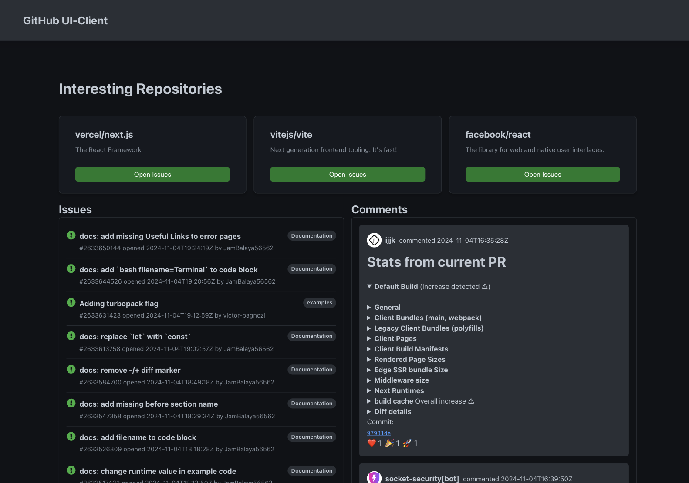
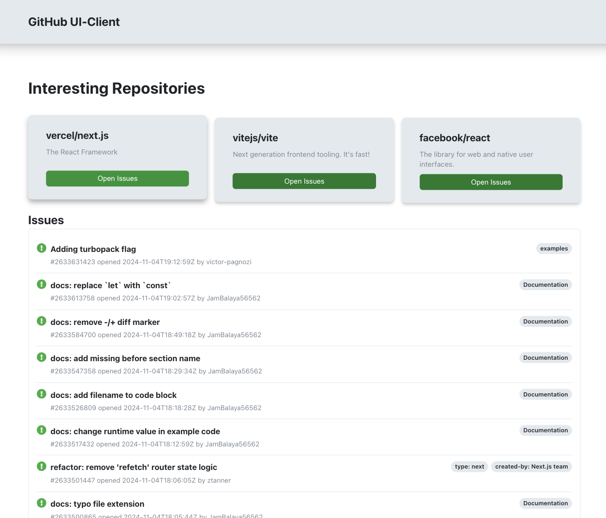

# GitHub Alternative Issue Visualizer ⁉️

## Description

GitHub UI-Client is a web application built with React and TypeScript that visualizes issues/comments from GitHub repositories. The app utilizes the GitHub API to retrieve and display issues in an organized, user-friendly format, offering an alternative way to view and analyze issues on GitHub.

## Features

-   Repository selection: View issues board of a selected repo.
-   Issue Details View: View detailed information on selected issues, **including comments, labels, reactions**.
-   Dark-light mode tracking the theme in device settings:

----------

## Getting Started

### Installation

1.  Clone the repository:
   
    `git clone https://github.com/----
    cd ---` 
    
2.  Install dependencies:
    
    `npm install` 
    
3.  Set up environment variables (Optional):
    
    -  Set REACT_APP_GITHUB_API_TOKEN=your_personal_access_token 
        in .env file 
        
    -   Replace your_personal_access_token with your GitHub API token. This is optional but recommended to avoid rate limits.
    
4.  Run the app:
    
    npm start 
    

----------

## Design Decisions
-   Desktop/Tablet Layout Only:
    
    -   **Focusing on desktop and tablet layouts** allowed the design to align closely with GitHub’s desktop UI, optimizing for wider screens. Mobile version requires a separate version (which is, actually, the best practice).

-   GitHub-Inspired Design:
    
    -   The design closely **follows GitHub’s visual style and color palette** to ensure familiarity for users accustomed to GitHub. 
    

-   No Additional Libraries:

    -   Aside from React and TypeScript, **no additional libraries were used**, keeping dependencies minimal. All styling is handled with standart CSS. Since this is a test task, I wanted to make the result as simple and as predictable as possible.

----------

## Challenges and Solutions

-   Creating Complex TypeScript Types for GitHub API:
    
    -   Challenge: GitHub API responses are large and deeply nested, making it time-consuming to manually create TypeScript types.

    -   Solution: I found an automated tool to convert JSON examples from the API documentation into TypeScript interfaces, saving time and reducing errors.

-   Organizing Code Without Additional Libraries:
    
    -   Challenge: Without using state management libraries, it was essential to keep the code modular and manageable.
    -   Solution: I divided the project into self-contained components (e.g., IssueBord, CommentsBoard) with local states.

    -   Challenge: Just a few days to make this task (I got to know about open interships too late).
    -   Solution: Worked 2 days, 12 hours per day, no work-life balance :)
----------

## Possible Improvements (Without new features)

Memorization for Performance Optimization:
    
- Use useMemo to prevent unnecessary re-renders of components that rely on static data or infrequent updates. This will improve performance, particularly for larger datasets.

Error and Loading State Management:

-   Implement standardized error and loading states across components, perhaps by creating reusable LoadingSpinner and ErrorMessage components. This would make UI feedback consistent and help users better understand app status.

Improved GitHub API Error Handling:

-   Enhance error handling for different API response codes (e.g., rate limits, authentication errors). This would provide users with clearer messages and guide them if issues arise

Adding ESlint:

-   Improve code quality and consistency
